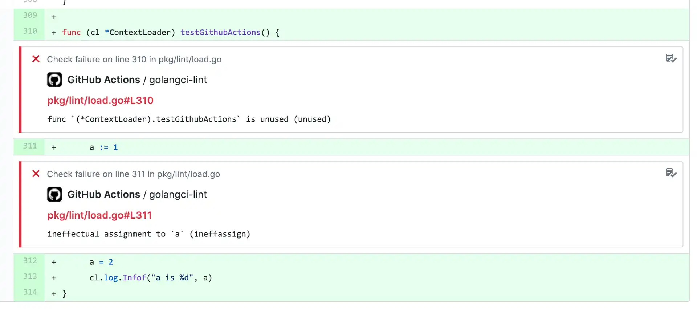

# 安装

> [原文链接](https://golangci-lint.run/usage/install/)

## CI 安装

`golangci-lint` 的大多数安装都是为 CI 执行的。

### Github Actions

我们建议使用 [我们的 GitHub Action](https://github.com/golangci/golangci-lint-action) 在 CI 中为 GitHub 项目运行 `golangci-lint`。它[速度很快，并且内部使用了智能缓存](https://github.com/golangci/golangci-lint-action#performance)，比简单的二进制安装要快得多。

此外，该 action 会为发现的问题创建 GitHub 注释：您无需深入 build log 即可查看 `golangci-lint` 发现的问题：



### 其他 CI

拥有可重现的 CI 非常重要：不要同时开始所有失败的构建。对于 `golangci-lint`，如果您使用了选项 `--enable-all` 并且添加了一个新的 linter，或者甚至在升级一个旧版的 linter 时没有使用 `--enable-all`，就会发生这种情况。

重要提示：强烈建议在 [releases page](https://github.com/golangci/golangci-lint/releases) 安装指定版本的 `golangci-lint`

下面是安装 golangci-lint v1.52.2 的推荐方式：

```sh
# binary will be $(go env GOPATH)/bin/golangci-lint
curl -sSfL https://raw.githubusercontent.com/golangci/golangci-lint/master/install.sh | sh -s -- -b $(go env GOPATH)/bin v1.52.2

# or install it into ./bin/
curl -sSfL https://raw.githubusercontent.com/golangci/golangci-lint/master/install.sh | sh -s v1.52.2

# In alpine linux (as it does not come with curl by default)
wget -O- -nv https://raw.githubusercontent.com/golangci/golangci-lint/master/install.sh | sh -s v1.52.2

golangci-lint --version
```

建议您定期更新 `golangci-lint` 的版本，因为该项目正在积极开发并不断改进。对于 `golangci-lint` 的任何问题，请查看最近的 [GitHub issues](https://github.com/golangci/golangci-lint/issues) 并在需要时进行更新。

## 本地安装

### 二进制

```sh
# binary will be $(go env GOPATH)/bin/golangci-lint
curl -sSfL https://raw.githubusercontent.com/golangci/golangci-lint/master/install.sh | sh -s -- -b $(go env GOPATH)/bin v1.52.2

golangci-lint --version
```

在 Windows 系统，您可以使用 Git Bash 运行上述命令，它随 [Git for Windows](https://git-scm.com/download/win) 一起提供。

### Docker

```sh
docker run --rm -v $(pwd):/app -w /app golangci/golangci-lint:v1.52.2 golangci-lint run -v
```

连续运行时保留缓存：

```sh
docker run --rm -v $(pwd):/app -v ~/.cache/golangci-lint/v1.52.2:/root/.cache -w /app golangci/golangci-lint:v1.52.2 golangci-lint run -v
```

带颜色输出：

```sh
docker run -t --rm -v $(pwd):/app -w /app golangci/golangci-lint:v1.52.2 golangci-lint run -v
```

### macOS

注意：brew 会使用一个不正确的 go 版本来构建二进制文件，所以我们推荐使用我们的二进制文件或者确定 go 版本后再构建。

您可以使用 [brew](https://brew.sh/) 在 macOS 上安装二进制版本：

```sh
brew install golangci-lint
brew upgrade golangci-lint
```

注意：以前我们使用 [homebrew tap](https://github.com/golangci/homebrew-tap)。我们推荐使用官方的 formula 而不是 tap，但是有时通过 homebrew 核心维护人员手动更新并无法适配最新的 release 版本。在这种情况下，可以使用自动更新的 tap formula 来安装最新版本的 `golangci-lint`。

> 译者：Homebrew Tap 是 Homebrew 包管理器的一个功能，它允许用户自定义软件包仓库。在 Homebrew 中，Tap 是指一个 Git 仓库，其中包含了一系列 Formula 和 Cask 的描述文件，这些文件描述了如何安装、升级和卸载特定软件包。
> 
> 通过创建自己的 Tap，用户可以将自己编写的软件包或者其他第三方软件包添加到 Homebrew 软件库中，从而使得这些软件包可以像 Homebrew 官方软件包一样被安装、升级和卸载。用户可以使用 homebrew tap 命令添加、删除和更新 Tap。

```sh
brew tap golangci/tap
brew install golangci/tap/golangci-lint
```

也可以通过 [macports](https://www.macports.org/) 安装 [macports](https://www.macports.org/) 安装方式是社区驱动的，不是 golangci 团队官方维护的。

```sh
sudo port install golangci-lint
```

### 源安装

注意：像这样使用 `go install`/`go get` 安装不能保证有效。我们建议使用二进制安装。

为什么呢？

`go install`/`go get` 安装不推荐，原因如下：

1. 一些用户使用 `go get` 时带上 `-u` 参数，这会升级我们的依赖。生成的配置未经测试，不一定有效。
2. `go.mod` 的 `replacement` 指令不适用。这意味着如果我们使用此类替换，用户将使用 `golangci-lint` 的补丁版本。
3. 它的稳定性取决于用户的 Go 版本（例如，在[这个 Go <= 1.12 的编译器 bug](https://github.com/golang/go/issues/29612) 上）。
4. 我们遇到了很多 Go 模块哈希的问题。
5. 它允许从 `master` 分支上安装，但这不能被认为是稳定的。
6. 安装速度比二进制安装慢。

```sh
go install github.com/golangci/golangci-lint/cmd/golangci-lint@v1.52.2
```

## 版本控制策略

`golangci-lint` 遵循[语义版本控制](https://semver.org/)。但是，由于 `golangci-lint` 作为一种代码质量工具的性质，并不总是很清楚何时会发生次要或主要版本冲突。为了帮助所有人明白这一点，我们定义了以下语义版本控制策略：

+ 补丁发布（旨在不破坏您的 lint 构建）
  + 特定 linter 中的补丁版本更新导致 `golangci-lint` 报告更少的错误。
  + CLI 或核心（包加载、运行器、后台进程等）的错误修复。
  + 文档改进。
  + 非面向用户的更改，例如重构代码、添加、删除或修改测试以及增加测试覆盖率。
  + 在发布失败后重新发布（即发布对任何人都不起作用的版本）。
+ 次要版本（可能会因为新发现的问题而破坏你的 lint 构建）
  + 特定 linter 的主要或次要版本的更新，会导致 `golangci-lint` 报告更多的错误。
  + 新增了一个 linter。
  + 弃用已存在的配置或 linter。
  + 创建了新的 CLI 命令。
  + 向后不兼容的配置更改具有极低的影响，例如添加一系列启用的 `go-critic` 检查器的验证。
+ 主要版本（可能会破坏你的 lint 构建）
  + 对配置进行了向后不兼容的更改，影响巨大，例如默认情况下从 `golint` 中删除了有关错过评论的 issue。
  + 删除了一个 linter。

根据我们的策略，任何次要更新都可能报告比以前版本更多的错误（例如：来自错误修复）。因此，我们建议使用固定的次要版本和固定的或最新的补丁版本来保证您的构建结果。

例如，在我们的 [GitHub Action](https://github.com/golangci/golangci-lint-action) 中，我们要求用户明确设置 `golangci-lint` 的次要版本，并且我们始终使用最新的补丁版本。